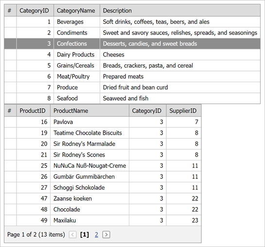

<!-- default badges list -->

[](https://supportcenter.devexpress.com/ticket/details/E70)
[](https://docs.devexpress.com/GeneralInformation/403183)
[](#does-this-example-address-your-development-requirementsobjectives)
<!-- default badges end -->

# Grid View for ASP.NET Web Forms - How to Show Detail Information in a Separate Grid


This example demonstrates how to use two [ASPxGridView](https://docs.devexpress.com/AspNet/DevExpress.Web.ASPxGridView?p=netframework) instances to show master-detail data. When a user selects a row in the master `ASPxGridView`, detail data is displayed in another `ASPxGridView`.



Once a focused row is changed in the master grid, its [FocusedRowChanged](https://docs.devexpress.com/AspNet/DevExpress.Web.ASPxGridView.FocusedRowChanged) event is raised. The `FocusedRowChanged` event handler calls the detail grid's [PerformCallback](https://docs.devexpress.com/AspNet/js-ASPxClientGridView.PerformCallback(args)?p=netframework) method to send a callback to the server:
```aspx
function UpdateDetailGrid(s, e) {
    detailGridView.PerformCallback();
}
 <dx:ASPxGridView ID="gvMaster" runat="server" 
                  ClientInstanceName="masterGridView"
                  KeyFieldName="CategoryID">            
    <SettingsBehavior AllowFocusedRow="True" AllowClientEventsOnLoad="False" />
    <ClientSideEvents FocusedRowChanged="UpdateDetailGrid" />
</dx:ASPxGridView>

<dx:ASPxGridView ID="gvDetail" runat="server" 
                 ClientInstanceName="detailGridView" 
                 KeyFieldName="ProductID"
                 OnCustomCallback="gvDetail_CustomCallback">
</dx:ASPxGridView>
```

On the server, the `PerformCallback` method raises the [CustomCallback](https://docs.devexpress.com/AspNet/DevExpress.Web.ASPxGridView.CustomCallback?p=netframework) event. The `CustomCallback` event handler establishes a master-detail relationship through the **`CategoryID`** field and updates the detail grid's data:

```cs
protected void gvDetail_CustomCallback(object sender, DevExpress.Web.ASPxGridView.ASPxGridViewCustomCallbackEventArgs e) {
    string categoryId = gvMaster.GetRowValues(gvMaster.FocusedRowIndex, "CategoryID").ToString();
    adsProducts.SelectParameters["CategoryID"].DefaultValue = categoryId;
    gvDetail.DataBind();
}
```    

## Files to Look At

* [Default.aspx](./CS/Default.aspx) (VB: [Default.aspx](./VB/Default.aspx))
* [Default.aspx.cs](./CS/Default.aspx.cs) (VB: [Default.aspx.vb](./VB/Default.aspx.vb))

## Documentation

* [Callbacks](https://docs.devexpress.com/AspNet/402559/common-concepts/callbacks)
* [Client-Side Events](https://docs.devexpress.com/AspNet/9448/common-concepts/client-side-functionality/client-side-events?p=netframework)
* [Grid View](https://docs.devexpress.com/AspNet/5823/components/grid-view?p=netframework)
* [Grid View - Master-Detail Relationship](https://docs.devexpress.com/AspNet/3772/components/grid-view/concepts/master-detail-relationship)

## More Examples

* [How to show the ASPxGridView's detail information in the ASPxDataView](https://github.com/DevExpress-Examples/how-to-show-the-aspxgridviews-detail-information-in-the-aspxdataview-e2529)
* [How to display master-detail tables in two grids on separate tabs of a PageControl](https://github.com/DevExpress-Examples/how-to-display-master-detail-tables-in-two-grids-on-separate-tabs-of-a-pagecontrol-e1285)
* [Grid View for ASP.NET Web Forms - How to Display a Popup Dialog When a User Clicks a Link in a Grid Row](https://github.com/DevExpress-Examples/aspxgridview-display-popup-when-user-clicks-cell-link)
* **MVC Version:** [How to export multiple GridViews into a single print document](https://github.com/DevExpress-Examples/how-to-export-multiple-gridviews-into-a-single-print-document-e3891)
<!-- feedback -->
## Does this example address your development requirements/objectives?

[](https://www.devexpress.com/support/examples/survey.xml?utm_source=github&utm_campaign=aspxgridview-show-detail-information-in-separate-grid&~~~was_helpful=yes) [](https://www.devexpress.com/support/examples/survey.xml?utm_source=github&utm_campaign=aspxgridview-show-detail-information-in-separate-grid&~~~was_helpful=no)

(you will be redirected to DevExpress.com to submit your response)
<!-- feedback end -->
